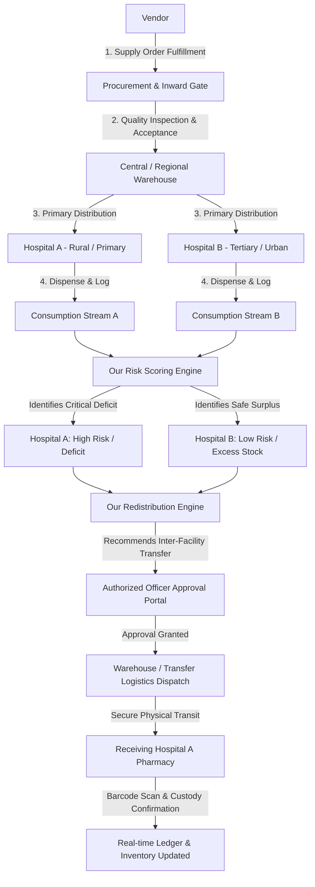
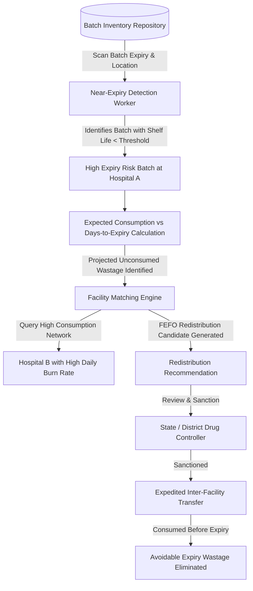

# 🏥 Smart Drug Supply Chain & Intelligent Redistribution System

> **Transforming Healthcare Logistics through Real-Time Inventory Intelligence, Transparent Risk Scoring, and Human-in-the-Loop Drug Redistribution.**

---

[← Return to Main Repository README](../README.md)

---

## 📌 Executive Summary

Modern public and private healthcare distribution systems face a critical paradox: while certain rural or peripheral hospitals suffer severe drug stockouts, neighboring regional hospitals or central warehouses hold excess inventory that expires unused on shelves. 

**Our project** addresses this structural supply chain failure by operationalizing the **"7 Rights"** of healthcare logistics. We bridge conventional Enterprise Resource Planning (ERP) with an **Intelligent Redistribution Engine** and **Near-Expiry Wastage Prevention Protocol**.

### The Key Architectural Distinction
```
Standard Supply Chain Coverage (Baseline):
  Procurement ──► Inventory ──► Distribution ──► Consumption ──► Passive Monitoring

Our System's Core Innovation:
  [Consumption + Inventory + History] ──► Risk Scoring Engine (0-100) ──► Imbalance Detection ──► Human-Approved Redistribution
  [Batch-Level Expiry + Burn Rate]    ──► Shelf-Life Depletion Model ──► Proactive FEFO Transfers ──► Zero Expiry Wastage
```

---

## 🎯 0. Core Objective — The "7 Rights"

Our system is engineered to guarantee and audit the seven fundamental tenets of pharmaceutical distribution:

| # | Right | Operational Definition & Our Implementation |
|---|---|---|
| 1 | **Right Product** | Precision drug verification via standardized Drug Master IDs, generic/brand mapping, formulation, and strength validation. |
| 2 | **Right Quantity** | Burn-rate-based stock allocation preventing under-ordering, stockouts, and artificial overstocking. |
| 3 | **Right Place** | Multi-echelon geospatial routing ensuring drugs reach the exact peripheral healthcare unit, district hospital, or warehouse. |
| 4 | **Right Time** | Dynamic shortage prediction shifting replenishment from reactive emergency orders to proactive lead-time dispatch. |
| 5 | **Right Condition** | Batch-level cold-chain tracking, strict shelf-life monitoring, quarantine controls, and FEFO (First-Expired, First-Out) dispatching. |
| 6 | **Right Cost** | End-to-end procurement and transfer cost visibility, batch unit pricing, transit overhead tracking, and wastage cost reduction. |
| 7 | **Right People** | Strict Role-Based Access Control (RBAC) ensuring only authorized pharmacists, officers, and dispatchers touch drug custody. |

---

## 🔄 End-to-End System Flow

### 1. Primary Supply Chain & Intelligent Redistribution Flow


### 2. Proactive Near-Expiry Wastage Elimination Flow


---

## 📦 Documentation Directory Index (Sibling Modules)

All specific module specifications in this directory:

### High-Level Architecture
* **[12. Complete System Architecture & Sequence Flows](./12_README_SYSTEM_ARCHITECTURE.md)** — Architectural blueprint, C4 micro-services topology, and end-to-end sequence diagrams.

### Core Supply Chain Modules
1. **[01. Drug & Batch Master Management](./01_README_DRUG_AND_BATCH_MASTER.md)**
   * Drug master catalog, categorization, minimum/target thresholds, batch lifecycle, manufacturing, and batch expiry tracking.
2. **[02. Procurement & Vendor Management](./02_README_PROCUREMENT_AND_VENDOR_MANAGEMENT.md)**
   * Vendor onboarding, purchase order lifecycles, receipt inspection, quality control, acceptance/rejection workflows, and vendor performance scorecard.
3. **[03. Inventory Intelligence & Multi-Echelon Stock](./03_README_INVENTORY_INTELLIGENCE.md)**
   * Real-time ledger (`Location → Drug → Batch → Quantity → Expiry → Condition`), available vs. reserved stock, stock-in/out, and threshold alerts.
4. **[04. Distribution & Supply Chain Movement Tracking](./04_README_DISTRIBUTION_AND_TRACKING.md)**
   * Multi-leg physical logistics (Vendor → Central Warehouse → Regional Warehouse → Hospital and Hospital ↔ Hospital transfers) with delay detection.
5. **[05. Hospital Consumption & Demand Intelligence](./05_README_HOSPITAL_CONSUMPTION.md)**
   * Granular consumption logging (daily/weekly/monthly), dynamic burn-rate tracking, peak demand anomalies, and days-of-stock indicators.
6. **[06. Quality & Expiry Management](./06_README_QUALITY_AND_EXPIRY_MANAGEMENT.md)**
   * Quarantine zones, batch damage logs, cold-chain excursion management, FEFO enforcement rules, and disposal auditing.

### Our Core Innovation Modules ⭐
7. **[07. Hospital Risk & Need Scoring Engine (⭐ Core Innovation)](./07_README_HOSPITAL_RISK_ENGINE.md)**
   * Transparent, defendable mathematical scoring model computing facility risk index ($0 - 100$) based on burn rate, stockout runway, criticality, and lead time.
8. **[08. Intelligent Inter-Facility Redistribution Engine (⭐⭐⭐ Core Innovation)](./08_README_INTELLIGENT_REDISTRIBUTION.md)**
   * Decision-support matching engine connecting donor (surplus) and recipient (high-risk) hospitals with distance matrix optimization and human approval.
9. **[09. Near-Expiry Redistribution & Wastage Elimination (⭐⭐⭐ Core Innovation)](./09_README_NEAR_EXPIRY_REDISTRIBUTION.md)**
   * Algorithm tracking batch shelf-life vs. local consumption rate, identifying unconsumed surplus, and recommending transfer to high-volume institutions.

### User Interface, Security & Governance
10. **[10. Multi-Role Tailored Dashboards](./10_README_MULTI_ROLE_DASHBOARDS.md)**
    * Four distinct, persona-specific interfaces: State Government Officer, Hospital Pharmacist, Warehouse Manager, and Procurement Vendor.
11. **[11. Common Infrastructure: RBAC, Audit, Alerts & Analytics](./11_README_COMMON_INFRASTRUCTURE.md)**
    * Role-Based Access Control (RBAC), immutable audit ledger (`who, what, when, why`), real-time notification dispatch, and state-level KPI engines.

---

## 👥 Multi-Role User Matrix

| User Role | Scope of Visibility | Primary Operational Focus | Key Questions Answered |
|---|---|---|---|
| **State Government Officer** | Statewide Macro View | Policy, macro-allocation, systemic risk, vendor performance, budget oversight. | *"What is happening across the entire state supply chain? Which facilities need intervention?"* |
| **Hospital Pharmacist** | Hospital Micro View | Local stock, daily dispensing, batch expiry, receipt confirmation, requisition requests. | *"What do we have on hand, what are we consuming, and what will run out next week?"* |
| **Warehouse Manager** | Warehouse Logistics | Inventory binning, picking, packing, dispatching, physical inward verification, transit manifests. | *"What stock needs to move, to which hospital, when, and on what vehicle?"* |
| **Procurement Vendor** | Vendor PO Portal | Contracted purchase orders, delivery scheduling, shipment dispatch, quality acceptance/rejection notes. | *"What purchase orders must I fulfill, and what is the quality acceptance status of recent deliveries?"* |

---

## 🧮 Mathematical Formulas Powering Our Innovations

### 1. Days of Stock Remaining (Runway)
$$\text{Days of Stock} = \frac{\text{Current Available Stock}}{\text{Average Daily Consumption (last 14 days)}}$$

### 2. Hospital Drug Need / Risk Score ($R_{h,d} \in [0, 100]$)
Our transparent scoring engine computes a composite risk score based on:
1. **Stock Runway Factor ($S_f$):** Evaluates days of stock against supplier lead time.
2. **Drug Criticality Weight ($W_c$):** Multiplier based on vital healthcare impact (Life-Saving = $1.0$, Essential = $0.7$, Routine = $0.4$).
3. **Pending Pipeline Ratio ($P_r$):** Accounts for verified inbound shipments in transit.
4. **Historical Shortage Factor ($H_s$):** Frequency of stockouts at facility over the past 90 days.

$$\text{Risk Score} = \min\left(100, \; \left( \left[ \frac{\text{Lead Time}}{\max(1, \text{Days of Stock})} \times 40 \right] + [W_c \times 30] + [H_s \times 20] - [P_r \times 20] \right) \right)$$

### 3. Near-Expiry Wastage Risk Metric
For a batch $b$ of drug $d$ located at hospital $h$:
$$\text{Projected Local Consumption Before Expiry} = \text{Remaining Days to Expiry} \times \text{Daily Consumption Rate}_h$$
$$\text{At-Risk Surplus Units} = \max\left(0, \; \text{Batch Quantity}_b - \text{Projected Local Consumption}\right)$$
When $\text{At-Risk Surplus Units} > 0$, our system triggers a **Near-Expiry Redistribution Candidate**.

---

## 📂 Project Directory Structure

```text
Smart-Drug-Supply-Chain/
├── README.md                                              # Master System Blueprint & Repository Landing Page
└── Plan and Documentation/                                # Modular Technical Specifications & Architecture
    ├── 00_README_MASTER.md                                # Master Blueprint (Mirror)
    ├── 01_README_DRUG_AND_BATCH_MASTER.md                 # Module 01: Drug Master & Batch Management
    ├── 02_README_PROCUREMENT_AND_VENDOR_MANAGEMENT.md     # Module 02: Inbound POs & Vendor QC
    ├── 03_README_INVENTORY_INTELLIGENCE.md                # Module 03: Multi-Echelon Stock Ledger
    ├── 04_README_DISTRIBUTION_AND_TRACKING.md             # Module 04: Physical Distribution & Transit
    ├── 05_README_HOSPITAL_CONSUMPTION.md                  # Module 05: Ward Dispensing & Burn Rates
    ├── 06_README_QUALITY_AND_EXPIRY_MANAGEMENT.md         # Module 06: Quality, FEFO & Quarantine
    ├── 07_README_HOSPITAL_RISK_ENGINE.md                  # Module 07: [Innovation ⭐] Facility Risk Score
    ├── 08_README_INTELLIGENT_REDISTRIBUTION.md            # Module 08: [Innovation ⭐⭐⭐] Lateral Transfers
    ├── 09_README_NEAR_EXPIRY_REDISTRIBUTION.md            # Module 09: [Innovation ⭐⭐⭐] Expiry Rescue
    ├── 10_README_MULTI_ROLE_DASHBOARDS.md                 # Module 10: 4 Role-Specific Dashboards
    ├── 11_README_COMMON_INFRASTRUCTURE.md                 # Infrastructure: RBAC, Audit, Alerts & KPIs
    └── 12_README_SYSTEM_ARCHITECTURE.md                   # Deep-Dive System Architecture & Flows
```

---

## ⚖️ Governance & Ethical Human-in-the-Loop Safeguard

> **Crucial System Rule:** Our algorithm **never** executes autonomous stock redistribution orders without human confirmation. The algorithm functions purely as an intelligent **Decision Support System (DSS)**. Every redistribution recommendation generated by our engine must be explicitly reviewed, validated, and signed off by an authorized State or District Medical Officer before a transfer shipment manifest is generated.

---
*Developed with focus on Healthcare Accessibility, Logistics Efficiency, and Zero-Wastage Pharmaceutical Distribution.*
