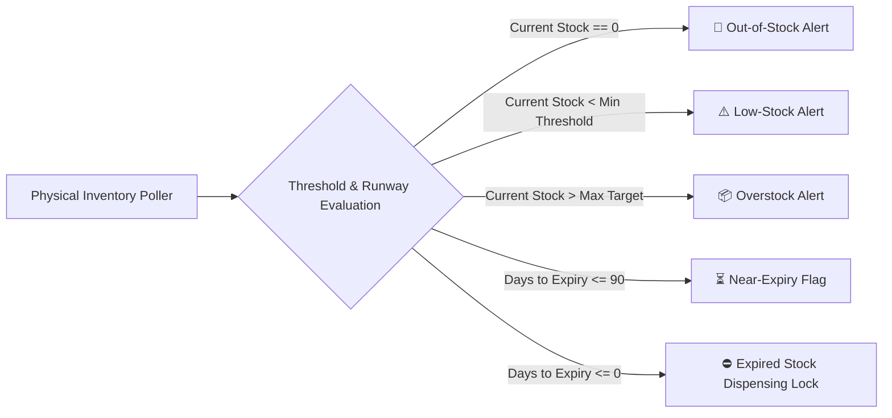

# 📊 Module 03: Inventory Management & Multi-Echelon Stock Intelligence

> **Real-Time Visibility Layer:** Answers the foundational operational question: *"What drug do we have, how much, which batch, where is it, and when does it expire?"*

---

## 🎯 1. Module Objective

This module delivers end-to-end ledger accounting across all central warehouses, regional distribution hubs, and hospital pharmacies. By maintaining multi-dimensional stock balances (`Location → Drug → Batch → Quantity → Expiry → Condition`), it feeds our predictive engines with high-fidelity, real-time inventory telemetry.

---

## 🧱 2. Domain Hierarchy & State Engine

```
Location (Central WH / Regional WH / Hospital)
   └── Drug Master Record
        └── Specific Physical Batch
             ├── Quantity (Total, Available, Reserved, Damaged)
             ├── Expiry Timestamp
             └── Condition (Cold Chain Verified / Ambient / Quarantined)
```

### Stock Breakdown Categorization
For any given pharmaceutical batch at any facility, inventory is subdivided into strict operational states:
* **Current Physical Stock ($S_{tot}$):** Total physical units stored on facility shelves or cold rooms.
* **Available Stock ($S_{avail}$):** Units uncommitted and ready for immediate dispensing or outbound shipment:
  $$S_{avail} = S_{tot} - (S_{reserved} + S_{damaged} + S_{expired} + S_{quarantine})$$
* **Reserved Stock ($S_{reserved}$):** Units committed to approved outbound transfers or queued patient prescriptions awaiting pickup.
* **Damaged / Quarantined Stock ($S_{damaged}$):** Physical units quarantined due to seal breakage, visual discoloration, or cold-chain breaches.
* **Near-Expiry Stock ($S_{near\_exp}$):** Stock with shelf life remaining $\le 90$ days (or configurable window).
* **Expired Stock ($S_{exp}$):** Stock exceeding its labeled expiry date; immediately flagged with an automated dispensing lock.

### Stock Movement Transactions (Immutable Ledger)
* **Stock-In:** Inbound receipts from procurement POs or inter-facility transfers.
* **Stock-Out:** Outbound shipments, hospital ward dispensing, patient dispensing.
* **Inventory Adjustment:** Cyclic audit reconciliations, shrinkage logging, or breakage write-offs (mandating dual authorization and audit justifications).

---

## 🧠 3. Inventory Intelligence Engine

Our automated background workers poll stock telemetry and publish instant alerts:



1. **Low-Stock Detection:** Triggered when $S_{avail} \le Q_{min}$ (configured in Drug Master).
2. **Out-of-Stock Detection:** Triggered when $S_{avail} = 0$, notifying administrators and flagging hospital priority for redistribution.
3. **Overstock Detection:** Triggered when $S_{avail} > Q_{max}$, identifying potential donor facilities for **Our Intelligent Redistribution Engine (Module 08)**.
4. **Critical-Drug Shortage Alert:** Instant high-priority escalation when a drug categorized as `VITAL` drops below 7 days of consumption runway.

---

## 🗄️ 4. Database Schema Blueprint

```sql
-- Inventory Balances Table (Aggregated Ledger)
CREATE TABLE inventory_balances (
    id UUID PRIMARY KEY DEFAULT gen_random_uuid(),
    location_id UUID NOT NULL,
    location_type VARCHAR(20) NOT NULL CHECK (location_type IN ('WAREHOUSE', 'HOSPITAL')),
    drug_id UUID NOT NULL REFERENCES drug_master(id),
    batch_id UUID NOT NULL REFERENCES drug_batches(id),
    quantity_on_hand INTEGER NOT NULL DEFAULT 0 CHECK (quantity_on_hand >= 0),
    quantity_reserved INTEGER NOT NULL DEFAULT 0 CHECK (quantity_reserved >= 0),
    quantity_damaged INTEGER NOT NULL DEFAULT 0 CHECK (quantity_damaged >= 0),
    last_audited_at TIMESTAMP WITH TIME ZONE,
    updated_at TIMESTAMP WITH TIME ZONE DEFAULT NOW(),
    CONSTRAINT uq_loc_batch UNIQUE (location_id, batch_id)
);

-- Immutable Inventory Transaction Journal
CREATE TABLE inventory_transactions (
    id UUID PRIMARY KEY DEFAULT gen_random_uuid(),
    transaction_type VARCHAR(30) NOT NULL 
        CHECK (transaction_type IN ('PO_RECEIPT', 'DISPENSE', 'TRANSFER_DISPATCH', 'TRANSFER_RECEIPT', 'AUDIT_ADJUSTMENT', 'DAMAGED_WRITE_OFF')),
    location_id UUID NOT NULL,
    location_type VARCHAR(20) NOT NULL,
    drug_id UUID NOT NULL REFERENCES drug_master(id),
    batch_id UUID NOT NULL REFERENCES drug_batches(id),
    quantity_delta INTEGER NOT NULL, -- Positive for stock-in, negative for stock-out
    reason TEXT,
    reference_id UUID, -- Reference to PO ID, Transfer ID, or Dispense ID
    performed_by UUID NOT NULL,
    created_at TIMESTAMP WITH TIME ZONE DEFAULT NOW()
);

CREATE INDEX idx_inv_loc_drug ON inventory_balances(location_id, drug_id);
CREATE INDEX idx_inv_tx_timestamp ON inventory_transactions(created_at DESC);
```

---

## 🔌 5. API Endpoints

| Method | Endpoint | Description | Role Required |
|---|---|---|---|
| `GET` | `/api/v1/inventory/facilities/{id}` | Full inventory breakdown for a facility | Facility Staff / Officer |
| `GET` | `/api/v1/inventory/drugs/{id}/network-stock` | Statewide stock distribution across all warehouses & hospitals | `GOV_OFFICER` |
| `POST` | `/api/v1/inventory/adjust` | Record audit cycle discrepancy or damage write-off | `WAREHOUSE_MGR`, `PHARMACIST` |
| `GET` | `/api/v1/inventory/alerts` | Query active low-stock, overstock, and expired stock alerts | All Roles |

---

## 🔗 6. Integration with Our Innovation Layer

By tracking available stock ($S_{avail}$) and reserved stock ($S_{reserved}$) on a live basis, this module ensures that:
* **Our Redistribution Engine (Module 08)** only locks truly available units, eliminating double-allocation.
* The exact batch details and physical location coordinates are instantly provided to warehouse pickers once a transfer order is sanctioned.
