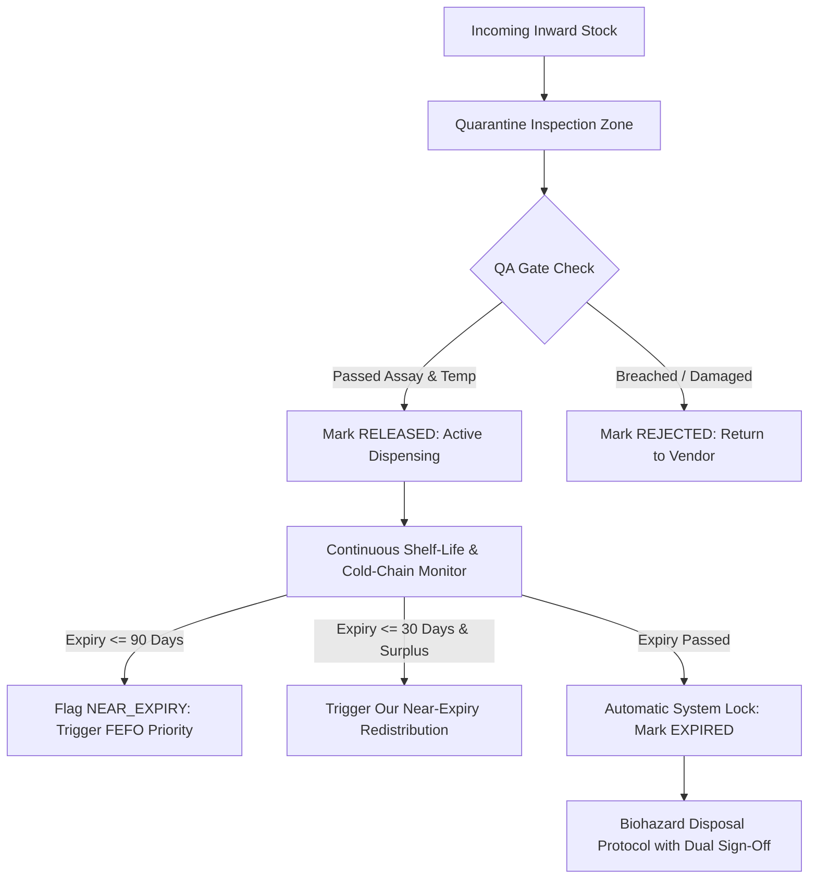

# 🛡️ Module 06: Quality & Expiry Management

> **Pharmaceutical Integrity & Wastage Prevention:** Enforces Good Distribution Practices (GDP), quarantine controls, cold-chain compliance, strict First-Expired, First-Out (FEFO) dispensing, and biological shelf-life monitoring.

---

## 🎯 1. Module Objective

This module ensures the **Right Condition** of our core objective. No medication should ever be administered if its therapeutic potency has degraded due to thermal excursions, seal breaches, or calendar expiration. Concurrently, it prevents fiscal and drug wastage by actively rotating older stock before newer batches.

---

## 🔬 2. Operational Quality Workflows



### Key Quality Pillars
1. **Cold-Chain Excursion Tracking:**
   * Temperature range enforcement: $2^\circ\text{C} - 8^\circ\text{C}$ (Vaccines, Insulin, Biologics).
   * Temperature data loggers read at receipt docks and transfer check-in. If breached $> 4$ hours, automated lock is imposed.
2. **First-Expired, First-Out (FEFO) Enforcement:**
   * Unlike standard manufacturing FIFO (First-In, First-Out), pharmaceutical safety requires **FEFO**.
   * When dispensing or allocating transfers, our database queries strictly sort available inventory by:
     ```sql
     ORDER BY expiry_date ASC, quantity_on_hand DESC
     ```
3. **Damaged Stock Identification & Isolation:**
   * Damaged packaging, glass vial fractures, or discolored solutions are flagged immediately.
   * Damaged units are subtracted from `quantity_available` into `quantity_damaged`, preventing inadvertent dispensing.

---

## 🗄️ 3. Database Schema Blueprint

```sql
-- Expiry Audit & Disposal Ledger
CREATE TABLE drug_disposal_logs (
    id UUID PRIMARY KEY DEFAULT gen_random_uuid(),
    facility_id UUID NOT NULL,
    batch_id UUID NOT NULL REFERENCES drug_batches(id),
    quantity_destroyed INTEGER NOT NULL CHECK (quantity_destroyed > 0),
    destruction_method VARCHAR(100) NOT NULL, -- High-temp Incineration, Encapsulation
    regulatory_certificate_num VARCHAR(100),
    witness_one_id UUID NOT NULL,
    witness_two_id UUID NOT NULL,
    disposed_at TIMESTAMP WITH TIME ZONE DEFAULT NOW()
);

-- Cold Chain Excursion Telemetry
CREATE TABLE cold_chain_telemetry (
    id UUID PRIMARY KEY DEFAULT gen_random_uuid(),
    facility_or_shipment_id UUID NOT NULL,
    sensor_id VARCHAR(50) NOT NULL,
    recorded_temperature NUMERIC(4,2) NOT NULL, -- in Celsius
    recorded_at TIMESTAMP WITH TIME ZONE DEFAULT NOW(),
    excursion_flag BOOLEAN DEFAULT FALSE
);

CREATE INDEX idx_telemetry_excursion ON cold_chain_telemetry(facility_or_shipment_id, recorded_at DESC);
```

---

## 🔌 4. API Endpoints

| Method | Endpoint | Description | Role Required |
|---|---|---|---|
| `POST` | `/api/v1/quality/inspect-batch` | Record comprehensive lab assay and dock inspection | `QA_OFFICER`, `WAREHOUSE_MGR` |
| `POST` | `/api/v1/quality/cold-chain-log` | Ingest IoT sensor temperature telemetry | System / Sensor Gateway |
| `POST` | `/api/v1/quality/isolate-damaged` | Move units to damaged quarantine zone | `PHARMACIST`, `WAREHOUSE_MGR` |
| `POST` | `/api/v1/quality/dispose-expired` | Record biohazard disposal with dual-witness audit | `PHARMACIST` + `GOV_OFFICER` |

---

## 💡 5. Value to Our Innovation Layer

By isolating near-expiry batches and calculating exact days until degradation, this module provides the raw trigger events for **Our Near-Expiry Redistribution Engine (Module 09)**, transforming potential fiscal loss into life-saving intervention.
