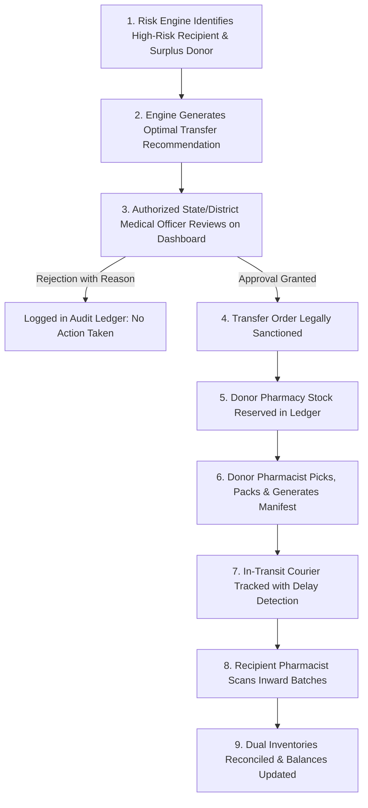

# ⭐⭐⭐ Module 08: Intelligent Redistribution Engine (Our Core Innovation)

> **Inter-Facility Rebalancing & Decision Support:** Dynamically matches deficit/high-risk hospitals with surplus donor facilities to orchestrate lateral stock transfers under strict human-in-the-loop governance.

---

## 🎯 1. Module Objective

Traditional healthcare systems operate in silos: when Hospital A runs out of a life-saving medication, patients suffer even if neighboring Hospital B sits on months of excess stock. 

**Our innovation** breaks these silos. The engine continuously detects imbalances across the regional healthcare network and generates optimized, logistics-aware **Lateral Redistribution Recommendations**.

---

## 🔄 2. The Decision Support Workflow (Human-in-the-Loop)

> **Fundamental Principle:** Our system **never** moves inventory automatically without human authorization. Healthcare logistics requires clinical, fiscal, and administrative validation. Our engine serves as an intelligent **Decision Support System (DSS)**.



---

## ⚙️ 3. Transfer Matching Algorithm & Constraints

When a hospital $H_{rec}$ is identified as having a high risk score ($R > 75$) for drug $D$, the matching algorithm executes the following sequence:

### Step 1: Identify Eligible Donor Hospitals
A hospital $H_{don}$ is eligible if:
$$S_{avail}(H_{don}, D) - Q_{transfer} \ge \text{Target Stock}(H_{don}, D)$$
And:
$$\text{Days of Stock remaining at } H_{don} \text{ after transfer} \ge 21 \text{ days}$$

### Step 2: Calculate Transferable Quantity ($Q_{transfer}$)
$$Q_{needed} = \text{Target Stock}(H_{rec}, D) - S_{avail}(H_{rec}, D)$$
$$Q_{surplus} = S_{avail}(H_{don}, D) - \text{Target Stock}(H_{don}, D)$$
$$Q_{transfer} = \min\left(Q_{needed}, \; Q_{surplus}\right)$$

### Step 3: Multi-Criteria Optimization Function
If multiple donor facilities qualify, the engine ranks candidates by an **Efficiency Score ($E_{score}$)**:
$$E_{score} = w_1 \cdot \left(\frac{1}{\text{Road Distance (km)}}\right) + w_2 \cdot \left(\text{Donor Surplus Ratio}\right) - w_3 \cdot \left(\text{Transit Temperature Risk}\right)$$
* **Logistics Distance:** PostGIS spatial queries rank the closest certified facility first to minimize road transit hours.
* **Batch Expiry Compatibility:** The batch selected at the donor hospital must have sufficient shelf-life to be fully consumed at the recipient hospital.

---

## 🗄️ 4. Database Schema Blueprint

```sql
-- Transfer Recommendations Table
CREATE TABLE transfer_recommendations (
    id UUID PRIMARY KEY DEFAULT gen_random_uuid(),
    drug_id UUID NOT NULL REFERENCES drug_master(id),
    source_hospital_id UUID NOT NULL,
    target_hospital_id UUID NOT NULL,
    recommended_quantity INTEGER NOT NULL CHECK (recommended_quantity > 0),
    distance_km NUMERIC(6,2) NOT NULL,
    estimated_transit_hours NUMERIC(4,1) NOT NULL,
    justification_log JSONB NOT NULL, -- Risk scores, consumption rates, formula inputs
    status VARCHAR(30) DEFAULT 'PENDING_APPROVAL' 
        CHECK (status IN ('PENDING_APPROVAL', 'APPROVED', 'REJECTED', 'DISPATCHED', 'COMPLETED', 'CANCELLED')),
    approved_by UUID,
    approved_at TIMESTAMP WITH TIME ZONE,
    rejection_reason TEXT,
    created_at TIMESTAMP WITH TIME ZONE DEFAULT NOW()
);

-- Linked Lateral Shipment Tracker
CREATE TABLE transfer_shipment_links (
    id UUID PRIMARY KEY DEFAULT gen_random_uuid(),
    recommendation_id UUID NOT NULL REFERENCES transfer_recommendations(id),
    shipment_id UUID NOT NULL REFERENCES shipments(id),
    batch_id UUID NOT NULL REFERENCES drug_batches(id),
    quantity INTEGER NOT NULL,
    created_at TIMESTAMP WITH TIME ZONE DEFAULT NOW()
);

CREATE INDEX idx_transfers_status ON transfer_recommendations(status);
CREATE INDEX idx_transfers_target ON transfer_recommendations(target_hospital_id, status);
```

---

## 🔌 5. API Endpoints

| Method | Endpoint | Description | Role Required |
|---|---|---|---|
| `GET` | `/api/v1/redistribution/recommendations` | List pending transfer recommendations | `GOV_OFFICER` |
| `POST` | `/api/v1/redistribution/recommendations/{id}/approve` | Sanction lateral transfer & lock donor stock | `GOV_OFFICER` |
| `POST` | `/api/v1/redistribution/recommendations/{id}/reject` | Reject recommendation with mandatory audit reason | `GOV_OFFICER` |
| `GET` | `/api/v1/redistribution/audit-history` | View end-to-end historical transfers and fulfillment rate | All Roles |

---

## 💡 6. System Distinction

By coupling **transparent mathematical matching** with **mandatory medical officer authorization**, our redistribution engine transforms inter-facility friction into a seamless, legally defensible, life-saving mechanism.
