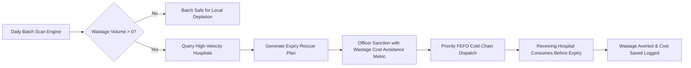

# ⭐⭐⭐ Module 09: Near-Expiry Redistribution & Wastage Elimination (Our Core Innovation)

> **Proactive Expiry Wastage Mitigation:** Intercepts pharmaceutical batches nearing expiration, projects local unconsumed surplus, and relocates units to high-turnover medical centers capable of dispensing them prior to expiration.

---

## 🎯 1. Module Objective

Avoidable medicine expiration is a catastrophic economic and healthcare failure. A hospital with low patient turnover may hold a batch that will expire in 45 days, resulting in total disposal loss, while a major trauma center 40 km away exhausts that exact drug daily.

**Our proposed innovation** actively evaluates every physical batch against local clinical burn rates, calculates the projected shelf-life deficit, and orchestrates **FEFO-driven redistribution** to guarantee near-zero pharmaceutical expiration wastage across the state network.

---

## 📉 2. The Shelf-Life Depletion Scenario

Consider a concrete real-world scenario evaluated by our engine:

```
DRUG: Ceftriaxone 1g Injection  |  BATCH: B-10928  |  EXPIRY: In 30 Days

Hospital A (Peripheral Rural Hospital)
──────────────────────────────────────
Current Batch Stock:      1,000 vials
Local Daily Consumption:  20 vials/day
Days Until Expiry:        30 days
Projected Consumption:    20 vials/day × 30 days = 600 vials
PROJECTED EXPIRATION:     400 vials wasted! ($4,000 fiscal loss)

Hospital B (District Civil Trauma Center)
──────────────────────────────────────────
Current Stock:            200 vials
Local Daily Consumption:  100 vials/day
Current Runway:           2.0 days (Approaching Stockout)

SYSTEM INTERVENTION:
Our engine detects the 400-vial impending wastage at Hospital A, pairs it with
the rapid burn rate of Hospital B, and recommends an immediate transfer:
                      Hospital A ──[ 400 Vials ]──► Hospital B
Outcome: Zero wastage at Hospital A, stockout prevented at Hospital B.
```

---

## 🧮 3. Mathematical Wastage Formula & Decision Rules

For any batch $b$ of drug $d$ stored at facility $h$:

### Step 1: Shelf Life Remaining ($T_{rem}$)
$$T_{rem} = \text{Expiry Date}_b - \text{Current Date} \quad (\text{in days})$$

### Step 2: Projected Local Consumption ($C_{proj}$)
$$C_{proj} = T_{rem} \times ADC_{14}(h, d)$$

### Step 3: At-Risk Wastage Volume ($W_{batch}$)
$$W_{batch} = \max\left(0, \; \text{Current Batch Quantity}_b - C_{proj}\right)$$

If $W_{batch} > 0$ and $T_{rem} \le \text{Threshold}$ (default 60 days):
The batch is flagged as an **Active Wastage Candidate**.

### Step 4: Finding Candidate Recipient Facilities
The search algorithm queries all network facilities $H_{cand}$ satisfying:
1. **Absorption Capacity:**
   $$T_{rem} \times ADC_{14}(H_{cand}, d) \ge W_{batch}$$
   *(The candidate facility must consume the entire transferred quantity before expiry)*.
2. **Transit Buffer Tolerance:**
   $$T_{rem} - \text{Transit Time (days)} \ge 10 \text{ days}$$
   *(Guarantees sufficient shelf life remains after courier delivery)*.
3. **FEFO Priority:** Recipient facility must commit to dispensing this transferred batch ahead of any newer batches on hand.

---

## 🔄 4. Operational Lifecycle & Governance



---

## 🗄️ 5. Database Schema Blueprint

```sql
-- Near Expiry Redistribution Candidates Table
CREATE TABLE near_expiry_redistribution_plans (
    id UUID PRIMARY KEY DEFAULT gen_random_uuid(),
    batch_id UUID NOT NULL REFERENCES drug_batches(id),
    drug_id UUID NOT NULL REFERENCES drug_master(id),
    source_facility_id UUID NOT NULL,
    target_facility_id UUID NOT NULL,
    at_risk_quantity INTEGER NOT NULL CHECK (at_risk_quantity > 0),
    days_to_expiry INTEGER NOT NULL,
    source_daily_consumption NUMERIC(8,2) NOT NULL,
    target_daily_consumption NUMERIC(8,2) NOT NULL,
    projected_cost_saved NUMERIC(12,2) NOT NULL,
    status VARCHAR(30) DEFAULT 'RECOMMENDED' 
        CHECK (status IN ('RECOMMENDED', 'SANCTIONED', 'DISPATCHED', 'RECEIVED', 'REJECTED', 'EXPIRED_WITHOUT_TRANSFER')),
    officer_approval_id UUID,
    approved_at TIMESTAMP WITH TIME ZONE,
    created_at TIMESTAMP WITH TIME ZONE DEFAULT NOW()
);

CREATE INDEX idx_near_exp_status ON near_expiry_redistribution_plans(status, days_to_expiry);
```

---

## 🔌 6. API Endpoints

| Method | Endpoint | Description | Role Required |
|---|---|---|---|
| `GET` | `/api/v1/expiry-rescue/candidates` | List active near-expiry redistribution recommendations | `GOV_OFFICER`, `PHARMACIST` |
| `POST` | `/api/v1/expiry-rescue/{id}/sanction` | Approve near-expiry transfer and issue priority dispatch | `GOV_OFFICER` |
| `GET` | `/api/v1/expiry-rescue/savings-report` | Financial report on cumulative drug wastage costs avoided | `GOV_OFFICER` |

---

## 🌟 7. Strategic Impact

This capability directly enforces the **Right Condition** and **Right Cost** pillars of our system. It turns expiring pharmaceutical liabilities into proactive life-saving assets, delivering demonstrable fiscal savings to state health directorates and eliminating unnecessary emergency procurement expenditures.
