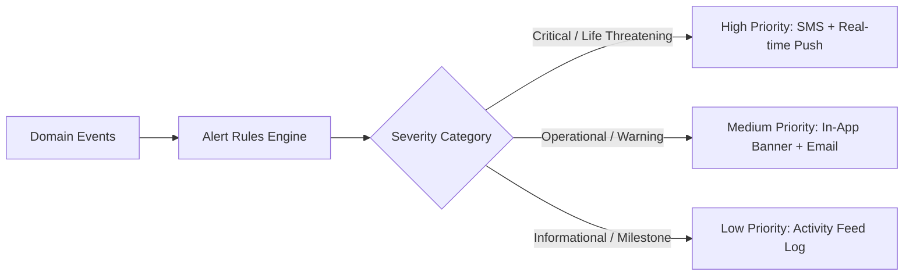

# 🔒 Common Infrastructure: Security, RBAC, Audit Trail, Alerts & Analytics

> **Enterprise Cross-Cutting Services:** Provides foundational security, strict multi-tenant authorization, tamper-evident audit logging, real-time alert dispatching, and high-performance KPI aggregations.

---

## 🎯 1. Module Objective

Healthcare pharmaceutical logistics requires absolute regulatory accountability and ironclad security. This infrastructure layer enforces the **Right People** of our core objective and ensures that every system event is cryptographically attributable, every critical threshold triggers an alert, and state-wide performance KPIs are continuously computed.

---

## 🛡️ 2. Role-Based Access Control (RBAC) & Tenancy Matrix

Our architecture enforces both **Role-Based Permissions** and **Data-Scoping Boundaries** (Tenancy Isolation):

```
Government Officer ──────► Full State Scope (All Warehouses & All Hospitals)
Warehouse Manager  ──────► Scoped strictly to assigned Warehouse Facility
Hospital Pharmacist ─────► Scoped strictly to assigned Hospital Pharmacy
Procurement Vendor ──────► Scoped strictly to assigned Vendor PO Records
```

| Permission Scope | Government Officer | Warehouse Manager | Hospital Pharmacist | Vendor |
|---|:---:|:---:|:---:|:---:|
| **View Statewide Risk Map** | ✅ Full Access | ❌ Forbidden | ❌ Forbidden | ❌ Forbidden |
| **Approve Lateral Transfers** | ✅ Sole Authority | ❌ Forbidden | ❌ Forbidden | ❌ Forbidden |
| **Create Purchase Orders** | ✅ Authorized | ❌ Forbidden | ❌ Forbidden | ❌ Forbidden |
| **Inward Dock QC Inspection** | 👁️ Read-Only | ✅ Authorized | ❌ Forbidden | ❌ Forbidden |
| **Log Ward Patient Dispensing**| 👁️ Read-Only | ❌ Forbidden | ✅ Authorized | ❌ Forbidden |
| **Accept Inbound Transfer** | 👁️ Read-Only | ❌ Forbidden | ✅ Authorized | ❌ Forbidden |
| **Dispatch In-Transit PO** | ❌ Forbidden | ❌ Forbidden | ❌ Forbidden | ✅ Authorized |
| **View Immutable Audit Logs** | ✅ Full Access | 👁️ Local Audit | 👁️ Local Audit | ❌ Forbidden |

---

## 📜 3. Tamper-Evident Audit & Traceability Engine

Every state-altering event in our system answers four non-negotiable questions:
$$\text{"Who changed what, when, where, and why?"}$$

### Logged Event Types
* **Inventory Adjustments:** Breakage write-offs, physical count reconciliations.
* **Transfer Approvals:** Timestamps, approving officer ID, and DSS algorithm justification snapshot.
* **Shipment Updates:** Dispatch times, seal checks, receipt signatures, and custody transitions.
* **Batch Rejections:** Specific lab assay failure reasons and photographic evidence links.
* **Procurement Changes:** Price updates, quantity amendments, and delivery schedule overrides.

### Database Schema (Append-Only Event Store)
```sql
CREATE TABLE audit_event_ledger (
    id UUID PRIMARY KEY DEFAULT gen_random_uuid(),
    event_timestamp TIMESTAMP WITH TIME ZONE DEFAULT NOW(),
    actor_id UUID NOT NULL,
    actor_role VARCHAR(50) NOT NULL,
    actor_ip_address INET,
    facility_id UUID,
    entity_name VARCHAR(100) NOT NULL, -- e.g. 'inventory_balance', 'transfer_recommendation'
    entity_id UUID NOT NULL,
    action_type VARCHAR(30) NOT NULL CHECK (action_type IN ('INSERT', 'UPDATE', 'DELETE', 'APPROVE', 'REJECT', 'DISPATCH', 'RECEIVE')),
    previous_state JSONB,
    new_state JSONB,
    reason_for_change TEXT NOT NULL,
    record_hash VARCHAR(64) NOT NULL -- SHA-256 (prev_hash + current_state)
);

CREATE INDEX idx_audit_entity ON audit_event_ledger(entity_name, entity_id);
CREATE INDEX idx_audit_actor ON audit_event_ledger(actor_id, event_timestamp DESC);
```

---

## 🔔 4. Multi-Channel Alert & Notification System

Our system continuously evaluates events and pushes notifications through In-App WebSockets, SMS, and Email:



### Alert Taxonomy
1. **Inventory Alerts:**
   * Low Stock Warning ($S_{avail} \le Q_{min}$).
   * Absolute Stockout ($S_{avail} = 0$).
   * Overstock Alert ($S_{avail} > Q_{max}$).
   * Near-Expiry Alert ($\le 90$ days to expiry).
   * Expired Batch Lockout ($\le 0$ days to expiry).
2. **Supply Chain Alerts:**
   * In-Transit Shipment Delay ($T_{current} > T_{exp\_arr}$).
   * Cold-Chain Thermal Excursion ($T_{sensor} \notin [2^\circ\text{C}, 8^\circ\text{C}]$).
   * Partial Delivery / Shipment Discrepancy.
   * Dockside Batch Rejection.
3. **Intelligence & Innovation Alerts (Our System):**
   * High-Risk Hospital Alert (Risk Score $> 80$).
   * Predicted Shortage Alert (Stock runway $< 5$ days).
   * Lateral Redistribution Opportunity Identified.
   * Near-Expiry Wastage Rescue Plan Generated.

---

## 📊 5. Statewide Analytics & Supply Chain KPI Matrix

Aggregated periodically into fast read-replicas for the State Government Dashboard:

| Domain | Key Performance Indicator (KPI) | Mathematical Formulation | Target Benchmark |
|---|---|---|---|
| **Procurement** | **Vendor Fulfillment Accuracy** | $\frac{\text{Accepted Quantity}}{\text{Contracted Quantity}} \times 100$ | $\ge 98\%$ |
| **Procurement** | **Average Procurement Lead Time** | $\text{Actual Inward Date} - \text{PO Date}$ | $\le 7\text{ days}$ |
| **Inventory** | **Network Stockout Rate** | $\frac{\text{Hospital-Drug Pairs with } 0 \text{ Stock}}{\text{Total Hospital-Drug Pairs}} \times 100$ | $< 1\%$ |
| **Inventory** | **Avoidable Expiry Wastage** | $\sum (\text{Expired Units} \times \text{Unit Cost})$ | $\$0$ (Target) |
| **Clinical** | **Average Facility Days of Stock** | $\frac{S_{avail}}{\text{Average Daily Consumption}}$ | $21 - 30\text{ days}$ |
| **Logistics** | **Redistribution Success Rate** | $\frac{\text{Completed Lateral Transfers}}{\text{Sanctioned Transfers}} \times 100$ | $\ge 99\%$ |
| **Logistics** | **Delivery Delay Rate** | $\frac{\text{Shipments Arriving Past SLA}}{\text{Total Dispatched Shipments}} \times 100$ | $< 3\%$ |

---

## 🔌 6. API Endpoints

| Method | Endpoint | Description | Role Required |
|---|---|---|---|
| `POST` | `/api/v1/auth/login` | Authenticate user & issue JWT with role/tenancy claims | Public |
| `GET` | `/api/v1/audit/logs` | Query immutable audit ledger with filters | `GOV_OFFICER` |
| `GET` | `/api/v1/alerts/unread` | Stream unread alerts for current authenticated user | All Authenticated |
| `PATCH` | `/api/v1/alerts/{id}/dismiss` | Acknowledge alert | All Authenticated |
| `GET` | `/api/v1/analytics/kpi-summary` | High-level executive KPI summary | `GOV_OFFICER` |
