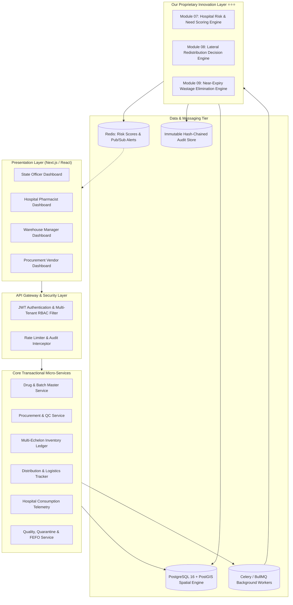
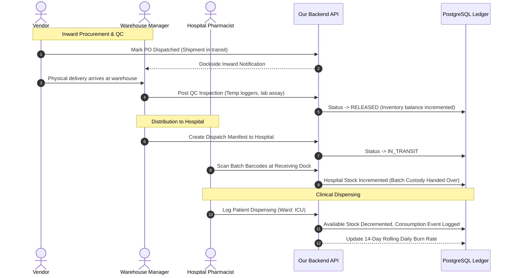
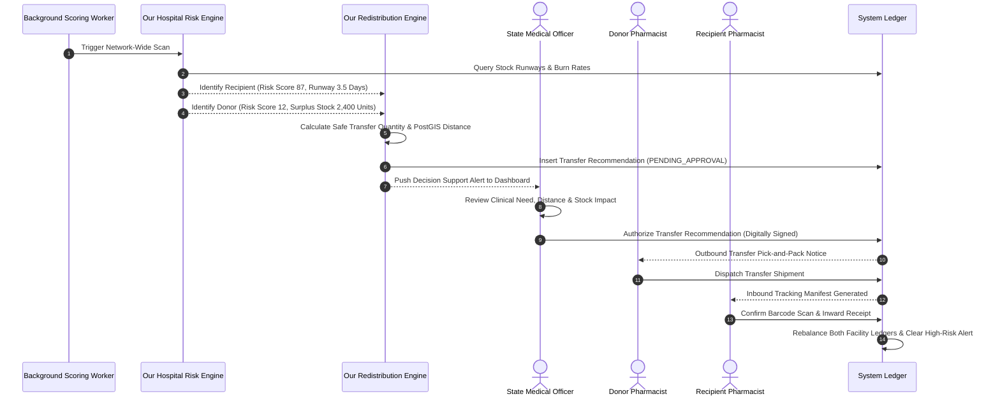
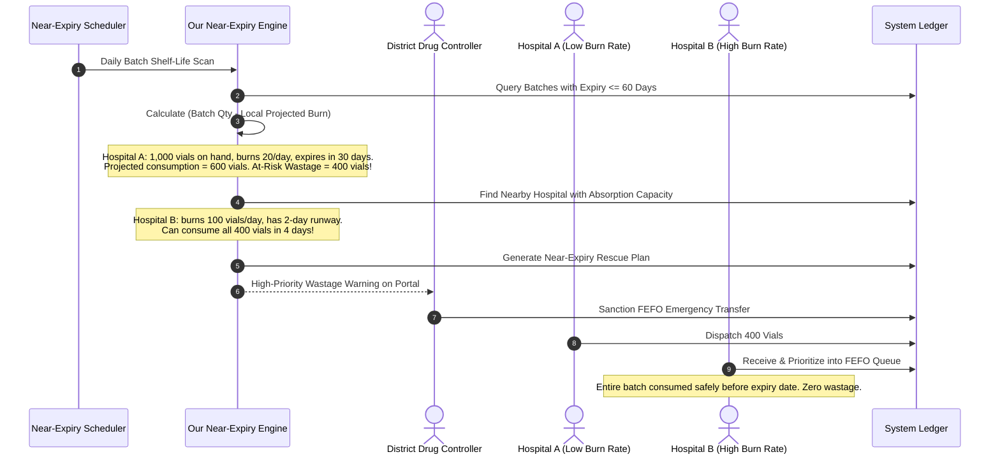

# 🏛️ System Architecture Blueprint: Smart Drug Supply Chain & Redistribution System

> **Comprehensive Technical Architecture:** Details our complete end-to-end system design, data flows, sequence diagrams, mathematical decision systems, and security boundaries.

---

## 🎯 1. Core Objective: The "7 Rights" Realization

Our architectural framework directly addresses each of the "7 Rights" of pharmaceutical logistics:

```
                  ┌──────────────────────────────────────────────┐
                  │           THE "7 RIGHTS" OF OUR SYSTEM       │
                  └──────────────────────┬───────────────────────┘
                                         │
       ┌──────────────────┬──────────────┴─────────────┬──────────────────┐
       ▼                  ▼                            ▼                  ▼
1. Right Product   2. Right Quantity             3. Right Place     4. Right Time
Standardized       Consumption-Driven            Geospatial Multi-  Lead-Time Shortage
Drug Master &      Burn Rates & Runway           Echelon Routing    Prediction Engine
Lot Verification   Allocation Models             & Dispatch         & Dispatch Triggers
       │                  │                            │                  │
       └──────────────────┼────────────────────────────┼──────────────────┘
                          │                            │
                          ▼                            ▼
                   5. Right Condition           6. Right Cost
                   Continuous Cold-Chain        Full Ledger & Transit
                   IoT & FEFO Enforcement       Cost Visibility
                          │
                          ▼
                   7. Right People
                   Strict Multi-Tenant RBAC
                   & Tamper-Evident Audit
```

---

## 🏗️ 2. High-Level Component & Service Architecture



---

## 🔁 3. Complete End-to-End Operational Sequences

### Sequence A: Procurement to Warehouse to Clinical Consumption


---

### Sequence B: Our Intelligent Redistribution Sequence (Inter-Hospital Balancing)


---

### Sequence C: Our Near-Expiry Redistribution Sequence (FEFO Wastage Mitigation)


---

## ⚖️ 4. Baseline Scope vs. Our Innovation Matrix

| Operational Scope | Industry Baseline Coverage | Our System's Proprietary Innovation |
|---|---|---|
| **Procurement** | Static PO creation, simple quantity tally | Dynamic lead-time tracking, automated VPI vendor scorecard, dockside cold-chain QC gate |
| **Inventory** | Basic item count at warehouse | Granular multi-echelon ledger: `Location → Drug → Batch → Quantity → Expiry → Condition` |
| **Consumption** | Periodic monthly inventory counts | Real-time point-of-care dispensing telemetry, rolling 14-day SMA burn rate |
| **Shortage Detection** | Reactive: *"We are out of stock today"* | Proactive: *"Days of Stock Remaining < 5 days; shortage predicted next Tuesday"* |
| **Inter-Facility Transfers** | Informal, manual phone calls between doctors | **⭐ Transparent Hospital Risk Scoring ($0-100$)** + **⭐⭐⭐ Decision-Support Matching Engine** with distance optimization and human approval |
| **Expiry Handling** | Passive write-offs and fiscal destruction | **⭐⭐⭐ Proactive Near-Expiry Wastage Elimination Engine** transferring at-risk units to high-turnover centers |
| **Governance & Access** | Single admin password or flat roles | 4 Dedicated, isolated dashboards + immutable hash-chained audit ledger |

---

## 🔒 5. Security, Tenancy & Compliance

1. **Authentication & Authorization:** JWT with asymmetric RSA-256 signing containing user role, assigned facility UUID, and permission scopes.
2. **Multi-Tenancy Isolation:** Row-Level Security (RLS) in PostgreSQL prevents hospital pharmacists from querying or modifying sibling facility records without explicit state-level transfer context.
3. **Data Integrity & Traceability:** Immutable audit ledger storing previous state, new state, user ID, IP address, and SHA-256 block hash for every state modification.
